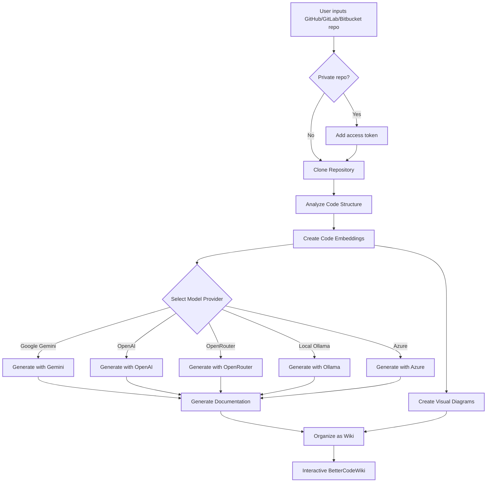

# BetterCodeWiki

> Originally based on [DeepWiki-Open](https://github.com/AsyncFuncAI/deepwiki-open) by AsyncFuncAI. BetterCodeWiki builds upon the foundation with an enhanced UI, 3D landing experience, improved diagrams, and additional features.

**BetterCodeWiki** automatically creates beautiful, interactive wikis for any GitHub, GitLab, or BitBucket repository. Just enter a repo name, and BetterCodeWiki will:

1. Analyze the code structure
2. Generate comprehensive documentation
3. Create visual diagrams to explain how everything works
4. Organize it all into an easy-to-navigate wiki

## Features

- **Instant Documentation**: Turn any GitHub, GitLab or BitBucket repo into a wiki in seconds
- **Private Repository Support**: Securely access private repositories with personal access tokens
- **Smart Analysis**: AI-powered understanding of code structure and relationships
- **Beautiful Diagrams**: Automatic Mermaid diagrams with animated flows and multi-color nodes
- **3D Landing Experience**: Immersive Three.js hero with interactive knowledge cube
- **Easy Navigation**: Intuitive sidebar with search, table of contents, and reading mode
- **Ask Feature**: Chat with your repository using RAG-powered AI to get accurate answers
- **DeepResearch**: Multi-turn research process that thoroughly investigates complex topics
- **Multiple Model Providers**: Support for Google Gemini, OpenAI, OpenRouter, and local Ollama models
- **Flexible Embeddings**: Choose between OpenAI, Google AI, or local Ollama embeddings
- **Visual Dependency Graph**: Force-directed graph visualization of code relationships
- **Export Options**: Export to Markdown, JSON, Notion, Confluence, and HTML formats
- **Global Search**: Command palette (Cmd+K) for quick navigation
- **Reading Mode**: Distraction-free reading with Alt+R toggle

## Quick Start

### Option 1: Using Docker

```bash
# Clone the repository
git clone https://github.com/REDFOX1899/BetterCodeWiki.git
cd BetterCodeWiki

# Create a .env file with your API keys
echo "GOOGLE_API_KEY=your_google_api_key" > .env
echo "OPENAI_API_KEY=your_openai_api_key" >> .env
# Optional: Use Google AI embeddings instead of OpenAI
echo "DEEPWIKI_EMBEDDER_TYPE=google" >> .env
# Optional: Add OpenRouter API key
echo "OPENROUTER_API_KEY=your_openrouter_api_key" >> .env
# Optional: Add Ollama host if not local
echo "OLLAMA_HOST=your_ollama_host" >> .env
# Optional: Azure OpenAI
echo "AZURE_OPENAI_API_KEY=your_azure_openai_api_key" >> .env
echo "AZURE_OPENAI_ENDPOINT=your_azure_openai_endpoint" >> .env
echo "AZURE_OPENAI_VERSION=your_azure_openai_version" >> .env

# Run with Docker Compose
docker-compose up
```

For detailed instructions on using with Ollama and Docker, see [Ollama Instructions](Ollama-instruction.md).

> **Where to get API keys:**
> - Google API key: [Google AI Studio](https://makersuite.google.com/app/apikey)
> - OpenAI API key: [OpenAI Platform](https://platform.openai.com/api-keys)
> - Azure OpenAI: [Azure Portal](https://portal.azure.com/)

### Option 2: Manual Setup

#### Step 1: Set Up Your API Keys

Create a `.env` file in the project root:

```
GOOGLE_API_KEY=your_google_api_key
OPENAI_API_KEY=your_openai_api_key
# Optional: Use Google AI embeddings
DEEPWIKI_EMBEDDER_TYPE=google
# Optional: OpenRouter models
OPENROUTER_API_KEY=your_openrouter_api_key
# Optional: Azure OpenAI
AZURE_OPENAI_API_KEY=your_azure_openai_api_key
AZURE_OPENAI_ENDPOINT=your_azure_openai_endpoint
AZURE_OPENAI_VERSION=your_azure_openai_version
# Optional: Ollama host
OLLAMA_HOST=your_ollama_host
```

#### Step 2: Start the Backend

```bash
python -m pip install poetry==2.0.1 && poetry install -C api
python -m api.main
```

#### Step 3: Start the Frontend

```bash
yarn install
yarn dev
```

#### Step 4: Use BetterCodeWiki!

1. Open [http://localhost:3000](http://localhost:3000) in your browser
2. Enter a GitHub, GitLab, or Bitbucket repository URL
3. For private repositories, click "+ Add access tokens" and enter your personal access token
4. Click "Generate Wiki" and watch the magic happen!

## How It Works

BetterCodeWiki uses AI to:

1. Clone and analyze the repository (including private repos with token authentication)
2. Create embeddings of the code for smart retrieval
3. Generate documentation with context-aware AI (Google Gemini, OpenAI, OpenRouter, Azure OpenAI, or Ollama)
4. Create visual diagrams to explain code relationships
5. Organize everything into a structured wiki
6. Enable intelligent Q&A through the Ask feature
7. Provide in-depth research capabilities with DeepResearch



## Project Structure

```
BetterCodeWiki/
├── api/                  # Backend API server
│   ├── main.py           # API entry point
│   ├── api.py            # FastAPI implementation
│   ├── rag.py            # Retrieval Augmented Generation
│   ├── data_pipeline.py  # Data processing utilities
│   ├── pyproject.toml    # Python dependencies (Poetry)
│   └── poetry.lock       # Locked Python dependency versions
│
├── src/                  # Frontend Next.js app
│   ├── app/              # Next.js app directory
│   │   └── page.tsx      # Main application page (3D landing)
│   └── components/       # React components
│       ├── landing/      # 3D landing page components
│       ├── Mermaid.tsx   # Enhanced diagram renderer
│       └── ...           # Additional UI components
│
├── public/               # Static assets
├── package.json          # JavaScript dependencies
└── .env                  # Environment variables (create this)
```

## Supported Providers and Models

- **Google**: Default `gemini-2.5-flash`, also supports `gemini-2.5-flash-lite`, `gemini-2.5-pro`, etc.
- **OpenAI**: Default `gpt-5-nano`, also supports `gpt-5`, `4o`, etc.
- **OpenRouter**: Access to multiple models via a unified API
- **Azure OpenAI**: Default `gpt-4o`, also supports `o4-mini`, etc.
- **Ollama**: Support for locally running open-source models like `llama3`

## Environment Variables

| Variable | Description | Required |
|----------|-------------|----------|
| `GOOGLE_API_KEY` | Google Gemini API key | No (required for Gemini) |
| `OPENAI_API_KEY` | OpenAI API key | Conditional |
| `OPENROUTER_API_KEY` | OpenRouter API key | No |
| `AZURE_OPENAI_API_KEY` | Azure OpenAI API key | No |
| `AZURE_OPENAI_ENDPOINT` | Azure OpenAI endpoint | No |
| `AZURE_OPENAI_VERSION` | Azure OpenAI version | No |
| `OLLAMA_HOST` | Ollama Host (default: http://localhost:11434) | No |
| `DEEPWIKI_EMBEDDER_TYPE` | `openai`, `google`, `ollama`, or `bedrock` | No |
| `OPENAI_BASE_URL` | Custom OpenAI API endpoint | No |
| `DEEPWIKI_CONFIG_DIR` | Custom config file location | No |
| `SERVER_BASE_URL` | API server URL (default: http://localhost:8001) | No |

## Docker Setup

```bash
# Pull and run
docker pull ghcr.io/asyncfuncai/deepwiki-open:latest

docker run -p 8001:8001 -p 3000:3000 \
  -e GOOGLE_API_KEY=your_key \
  -e OPENAI_API_KEY=your_key \
  -v ~/.adalflow:/root/.adalflow \
  ghcr.io/asyncfuncai/deepwiki-open:latest
```

Or use Docker Compose:

```bash
docker-compose up
```

## Ask & DeepResearch

- **Ask**: Chat with your repository using RAG for context-aware, streaming responses
- **DeepResearch**: Multi-turn research with structured plans, updates, and comprehensive conclusions

## Troubleshooting

- **"Missing environment variables"**: Check your `.env` file in the project root
- **"API key not valid"**: Verify the key with no extra spaces
- **"Cannot connect to API server"**: Ensure the API server is running on port 8001
- **"Error generating wiki"**: Try a smaller repository first

## Credits

This project is based on [DeepWiki-Open](https://github.com/AsyncFuncAI/deepwiki-open) by [AsyncFuncAI](https://github.com/AsyncFuncAI). The original project is licensed under the MIT License.

## License

This project is licensed under the MIT License - see the [LICENSE](LICENSE) file for details.
