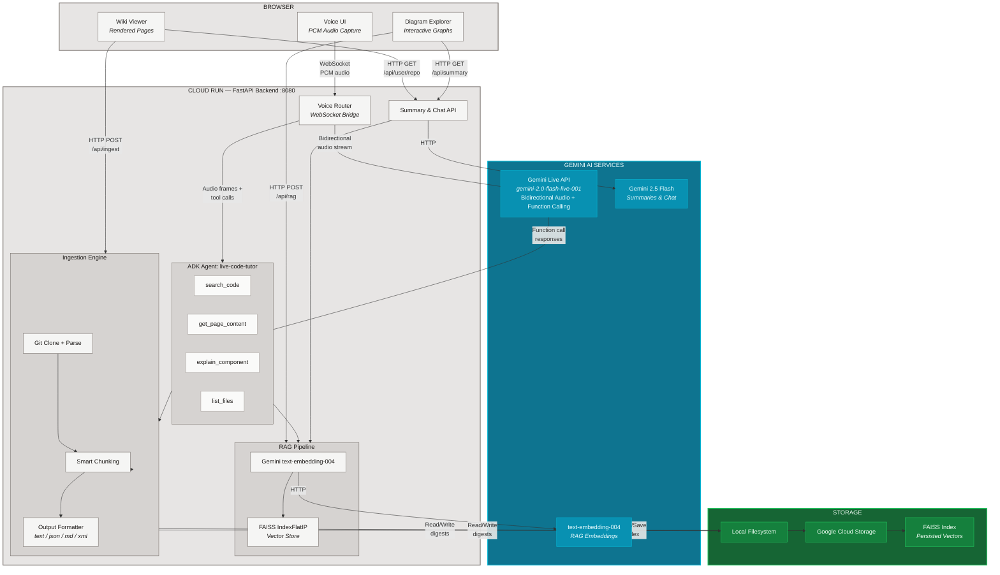
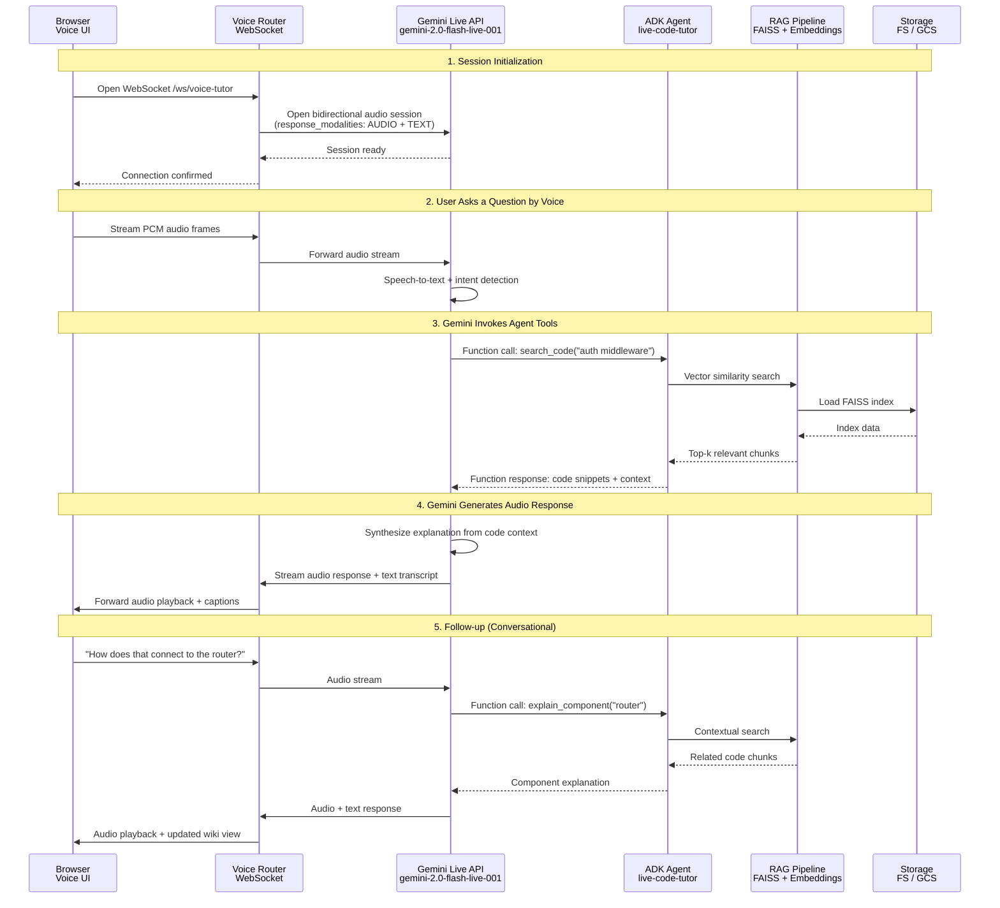

# BetterCodeWiki — Live Code Tutor Architecture

## System Architecture

```mermaid
graph TB
    subgraph BROWSER["BROWSER"]
        style BROWSER fill:#e7e5e4,stroke:#78716c,stroke-width:2px,color:#1c1917
        VoiceUI["Voice UI<br/><i>PCM Audio Capture</i>"]
        WikiViewer["Wiki Viewer<br/><i>Rendered Pages</i>"]
        DiagramExplorer["Diagram Explorer<br/><i>Interactive Graphs</i>"]
    end

    subgraph CLOUDRUN["CLOUD RUN &mdash; FastAPI Backend :8080"]
        style CLOUDRUN fill:#e7e5e4,stroke:#78716c,stroke-width:2px,color:#1c1917

        VoiceRouter["Voice Router<br/><i>WebSocket Bridge</i>"]

        subgraph ADK["ADK Agent: live-code-tutor"]
            style ADK fill:#d6d3d1,stroke:#78716c,stroke-width:1px,color:#1c1917
            SearchCode["search_code"]
            GetPage["get_page_content"]
            ExplainComp["explain_component"]
            ListFiles["list_files"]
        end

        subgraph RAG["RAG Pipeline"]
            style RAG fill:#d6d3d1,stroke:#78716c,stroke-width:1px,color:#1c1917
            Embedder["Gemini text-embedding-004"]
            FAISS["FAISS IndexFlatIP<br/><i>Vector Store</i>"]
        end

        subgraph Ingestion["Ingestion Engine"]
            style Ingestion fill:#d6d3d1,stroke:#78716c,stroke-width:1px,color:#1c1917
            GitClone["Git Clone + Parse"]
            Chunking["Smart Chunking"]
            Formatter["Output Formatter<br/><i>text / json / md / xml</i>"]
        end

        SummaryChat["Summary &amp; Chat API"]
    end

    subgraph GEMINI["GEMINI AI SERVICES"]
        style GEMINI fill:#0e7490,stroke:#06b6d4,stroke-width:2px,color:#ecfeff
        LiveAPI["Gemini Live API<br/><i>gemini-2.0-flash-live-001</i><br/>Bidirectional Audio + Function Calling"]
        FlashModel["Gemini 2.5 Flash<br/><i>Summaries &amp; Chat</i>"]
        EmbeddingModel["text-embedding-004<br/><i>RAG Embeddings</i>"]
    end

    subgraph STORAGE["STORAGE"]
        style STORAGE fill:#166534,stroke:#22c55e,stroke-width:2px,color:#f0fdf4
        LocalFS["Local Filesystem"]
        GCS["Google Cloud Storage"]
        FAISSPersist["FAISS Index<br/><i>Persisted Vectors</i>"]
    end

    %% Browser to Backend connections
    VoiceUI -->|"WebSocket<br/>PCM audio"| VoiceRouter
    WikiViewer -->|"HTTP GET<br/>/api/user/repo"| SummaryChat
    DiagramExplorer -->|"HTTP GET<br/>/api/summary"| SummaryChat
    WikiViewer -->|"HTTP POST<br/>/api/ingest"| Ingestion
    DiagramExplorer -->|"HTTP POST<br/>/api/rag"| RAG

    %% Internal backend connections
    VoiceRouter -->|"Audio frames +<br/>tool calls"| ADK
    ADK --> RAG
    ADK --> Ingestion
    SummaryChat --> RAG
    Ingestion --> Chunking
    Chunking --> Formatter
    GitClone --> Chunking
    Embedder --> FAISS

    %% Backend to Gemini connections
    VoiceRouter ---|"Bidirectional<br/>audio stream"| LiveAPI
    LiveAPI ---|"Function call<br/>responses"| ADK
    SummaryChat -->|"HTTP"| FlashModel
    Embedder -->|"HTTP"| EmbeddingModel

    %% Backend to Storage connections
    Ingestion -->|"Read/Write<br/>digests"| LocalFS
    Ingestion -->|"Read/Write<br/>digests"| GCS
    RAG -->|"Load/Save<br/>index"| FAISSPersist

    %% Node styles
    style VoiceUI fill:#f5f5f4,stroke:#78716c,color:#1c1917
    style WikiViewer fill:#f5f5f4,stroke:#78716c,color:#1c1917
    style DiagramExplorer fill:#f5f5f4,stroke:#78716c,color:#1c1917
    style VoiceRouter fill:#f5f5f4,stroke:#78716c,color:#1c1917
    style SearchCode fill:#fafaf9,stroke:#a8a29e,color:#1c1917
    style GetPage fill:#fafaf9,stroke:#a8a29e,color:#1c1917
    style ExplainComp fill:#fafaf9,stroke:#a8a29e,color:#1c1917
    style ListFiles fill:#fafaf9,stroke:#a8a29e,color:#1c1917
    style Embedder fill:#f5f5f4,stroke:#78716c,color:#1c1917
    style FAISS fill:#f5f5f4,stroke:#78716c,color:#1c1917
    style GitClone fill:#f5f5f4,stroke:#78716c,color:#1c1917
    style Chunking fill:#f5f5f4,stroke:#78716c,color:#1c1917
    style Formatter fill:#f5f5f4,stroke:#78716c,color:#1c1917
    style SummaryChat fill:#f5f5f4,stroke:#78716c,color:#1c1917
    style LiveAPI fill:#0891b2,stroke:#06b6d4,color:#ecfeff
    style FlashModel fill:#0891b2,stroke:#06b6d4,color:#ecfeff
    style EmbeddingModel fill:#0891b2,stroke:#06b6d4,color:#ecfeff
    style LocalFS fill:#15803d,stroke:#22c55e,color:#f0fdf4
    style GCS fill:#15803d,stroke:#22c55e,color:#f0fdf4
    style FAISSPersist fill:#15803d,stroke:#22c55e,color:#f0fdf4
```

## Voice Tutoring Flow

```mermaid
sequenceDiagram
    participant User as Browser<br/>Voice UI
    participant WS as Voice Router<br/>WebSocket
    participant Live as Gemini Live API<br/>gemini-2.0-flash-live-001
    participant Agent as ADK Agent<br/>live-code-tutor
    participant RAG as RAG Pipeline<br/>FAISS + Embeddings
    participant Store as Storage<br/>FS / GCS

    Note over User,Store: 1. Session Initialization
    User->>WS: Open WebSocket /ws/voice-tutor
    WS->>Live: Open bidirectional audio session<br/>(response_modalities: AUDIO + TEXT)
    Live-->>WS: Session ready
    WS-->>User: Connection confirmed

    Note over User,Store: 2. User Asks a Question by Voice
    User->>WS: Stream PCM audio frames
    WS->>Live: Forward audio stream
    Live->>Live: Speech-to-text + intent detection

    Note over User,Store: 3. Gemini Invokes Agent Tools
    Live->>Agent: Function call: search_code("auth middleware")
    Agent->>RAG: Vector similarity search
    RAG->>Store: Load FAISS index
    Store-->>RAG: Index data
    RAG-->>Agent: Top-k relevant chunks
    Agent-->>Live: Function response: code snippets + context

    Note over User,Store: 4. Gemini Generates Audio Response
    Live->>Live: Synthesize explanation from code context
    Live->>WS: Stream audio response + text transcript
    WS->>User: Forward audio playback + captions

    Note over User,Store: 5. Follow-up (Conversational)
    User->>WS: "How does that connect to the router?"
    WS->>Live: Audio stream
    Live->>Agent: Function call: explain_component("router")
    Agent->>RAG: Contextual search
    RAG-->>Agent: Related code chunks
    Agent-->>Live: Component explanation
    Live->>WS: Audio + text response
    WS->>User: Audio playback + updated wiki view
```
